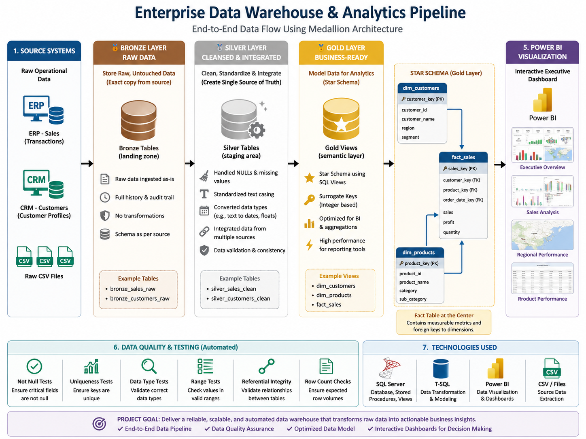
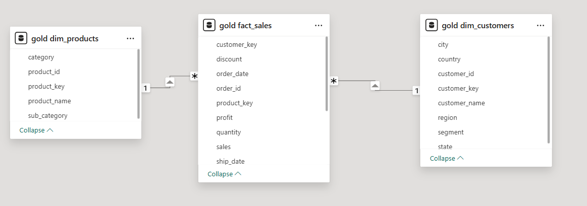
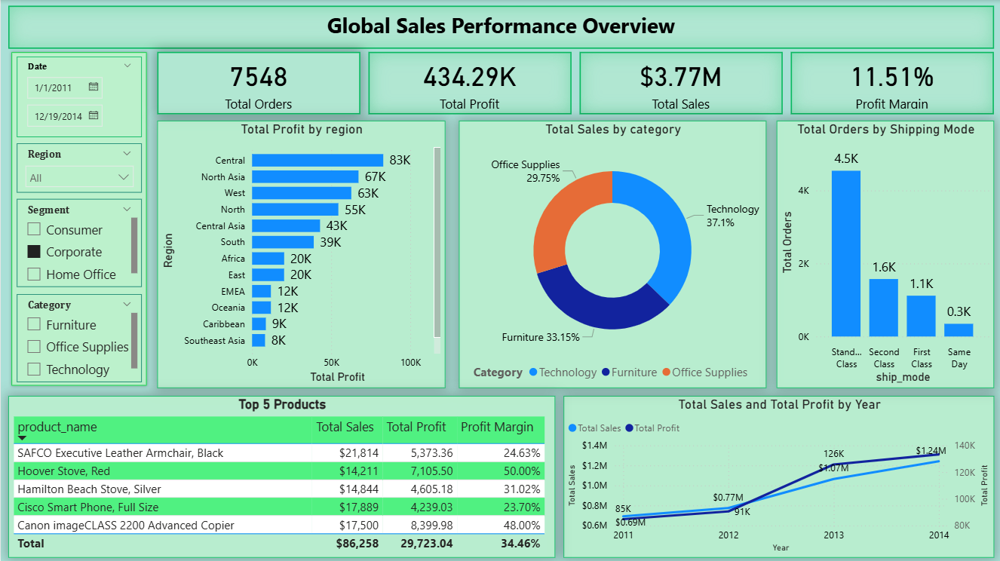

# 🏢 Enterprise Data Warehouse & Analytics Pipeline

## 📖 Project Overview
This project is an end-to-end Data Engineering and Business Intelligence solution. It takes raw, messy sales and customer data and transforms it into a highly optimized, automated data warehouse using SQL Server. Finally, it connects to Power BI to deliver an interactive executive dashboard.

The goal of this project was to demonstrate a full data lifecycle: extracting data, cleaning it, modeling it for performance, writing automated data quality tests, and building a visualization layer.

---



## 🏗️ System Architecture (The Medallion Architecture)
This data warehouse was built using the industry-standard **Medallion Architecture** to logically separate data as it flows through the pipeline:

1. **🥉 Bronze Layer (Raw Data):** 
   - Stores the exact, raw data dumped from the source systems (ERP Sales and CRM Customers).
   - *Goal:* Keep an untouched history of the original files.
2. **🥈 Silver Layer (Cleansed & Integrated):** 
   - Data is cleaned using SQL Stored Procedures.
   - Handled `NULL` values, standardized text casing, and safely converted data types (e.g., text to Dates/Floats).
   - *Goal:* Create a reliable, "single source of truth" for the enterprise.
3. **🥇 Gold Layer (Business-Ready):** 
   - Data is remodeled into a **Star Schema** using SQL Views.
   - *Goal:* Highly optimized for BI tools to read and aggregate millions of rows instantly.

---

## 🌟 Data Modeling: The Star Schema
Instead of forcing the BI tool to read flat, repetitive tables, the Gold layer was structured into a Star Schema. We generated integer **Surrogate Keys** to link the tables together efficiently.

* **`dim_customers` (Dimension):** Contains unique customer profiles (Name, Region, Segment) mapped to a new `customer_key`.
* **`dim_products` (Dimension):** A distinct list of all products sold (Category, Sub-Category) mapped to a `product_key`.
* **`fact_sales` (Fact Table):** The center of the star. It contains only measurable metrics (Sales, Profit, Quantity) and the integer keys that point back to the dimension tables. 



---

## 🛡️ Data Quality & Automated Testing
A massive part of data engineering is ensuring data integrity. I wrote a suite of automated SQL tests (`silver_quality_check.sql` and `gold_quality_checks.sql`) to run after the ETL process.

### 🐛 The Problem We Caught
During testing, the Silver Quality Check flagged **1 invalid record** out of 51,290 sales. 
Upon investigation, a "Hoover Replacement Belt" was found with `$0` in Sales and a `-1.11` Profit. This was a free warranty replacement. While technically a real transaction, executives only want to see *revenue-generating* sales on the main dashboard to avoid skewing the Average Order Value.

### 🛠️ The Engineering Fix
Instead of manually deleting the row, I updated the Bronze-to-Silver ETL Stored Procedure (`proc_load_silver.sql`). I added a strict data quality rule to the `WHERE` clause:
```sql
WHERE order_id IS NOT NULL 
  AND TRY_CAST(sales AS FLOAT) > 0;
```

After re-running the pipeline, the automated tests passed with zero errors, ensuring only clean, profitable data reached the Gold layer.

---

## 📊 Business Intelligence (Power BI)
With the backend perfectly modeled, the three Gold views were imported into Power BI using a **1-to-Many (*:1)** relationship model.

**Dashboard Features:**
- **DAX Measures:** Custom calculators created for `Total Sales`, `Total Profit`, `Total Orders`, and `Profit Margin` (using the safe `DIVIDE` function).
- **Interactive UI:** A green-themed left control panel featuring dropdown slicers for Year, Region, Segment, and Category.
- **Visual Insights:** Includes revenue trends over time, geographic profitability, product mix, shipping mode efficiency, and a locked-width matrix highlighting the Top 5 most profitable products.



---


